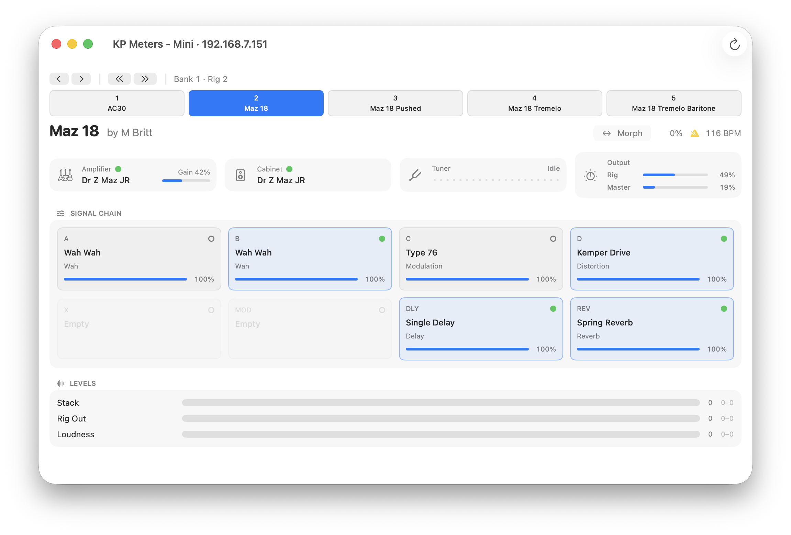

# libkp

I have a Kemper Profiler Player. It works great for my needs, but I find the software 
that Kemper provides frustrating at basically every level. Among them: why can I control
my Kemper using the mobile app on the network, but not via the desktop app they also ship
that contains almost a completely identical set of functionality?

So I did what any sane person in this position might do: investigate the traffic between
the mobile app and the device to develop a clean-room based reverse engineering of the discovery
and wire protocols that control my device.

This is libkp - an incomplete but functional cross-platform library for controlling network-connected
Kemper devices. It is documented as a spec and implemented in Python, Rust, and Swift. It's capable
of real-time device monitoring on all three platforms. 

Example apps are provided on each platform, including a prototype-grade remote control for MacOS.



This work would of course not be possible without significant help from Claude. This started as an evening
hack idea, and has turned into a reasonably well-put together project that makes it easier to make music
with my hands.

## Getting started

| Language | Package | Needs | Directory |
|---|---|---|---|
| Rust   | `libkp` | Rust 1.85+, `tokio`                     | [`rust/`](rust/) |
| Python | `libkp` | Python 3.11+, standard library only     | [`python/`](python/) |
| Swift  | `LibKP` | Swift 6, macOS 13+, `Network` framework | [`swift/`](swift/) |

Python is on PyPI — `pip install libkp`. Rust and Swift are not on a registry
yet; depend on the directory as a path or git dependency. The shape of the API
is the same everywhere — find a device, connect a model, subscribe to its
state, send it things:

```rust
use libkp::model::DeviceModel;
use std::time::Duration;

// Find a Profiler on the LAN, or skip straight to `connect` with a known IP.
let reply = libkp::find_first(Duration::from_secs(3)).await?;
let ip = reply.and_then(|r| r.ipv4()).expect("no Profiler on the LAN");

// One connect is the whole session: the MIDI3 stream plus the CBOR control link.
let model = DeviceModel::connect(ip).await?;
let mut snapshots = model.subscribe();

model.set_effect_enabled("REV", false).await?;   // a tracked write
let rev_on = model.request_param(0x3D, 3).await?; // …and its read-back
model.step_rig(1);                                // the Navigator loads the next rig

while let Ok(state) = snapshots.recv().await {
    println!("{:?}  rig: {:?}  morph: {:?}", state.connection, state.rig.name, state.morph);
}
```

The Python and Swift APIs mirror this; each directory's README has the
equivalent walkthrough.

Every implementation ships the same example, **`meters`** — a live terminal view
of the current rig, its effect blocks, the tuner strobe, and the output meters:

```sh
cd rust   && cargo run --example meters            # add `-- --ip 192.168.1.50` to skip discovery
cd python && uv run examples/meters.py             # or `pip install -e .` then `python examples/meters.py`
cd swift  && swift run meters                      # or `swift run MetersApp` for the macOS app
```

Discovery needs UDP port 5727 to itself, so quit Kemper's Rig Manager (or pass
`--ip`) before running it.

### Built on libkp

- [**kemper-homeassistant**](https://github.com/gotwalt/kemper-homeassistant) —
  a Home Assistant integration: the rig, the amp, the cabinet, and whether
  anyone is playing, held on one session that never polls the device. It
  depends on `libkp` from PyPI, and tests against
  [`libkp.testing.FakeDevice`](python/README.md#testing-against-a-fake-profiler).

## Status

Tested against a **Profiler Player on firmware 14.2.1**. Other Profiler models
and firmware versions are untested; the protocol appears to be shared, but
nothing here has confirmed that.

Works:

- LAN discovery, the TCP handshake, and the MIDI3 session
- NRPN parameter reads and writes, and the 7-bit CC control vocabulary
- The realtime meter and tuner stream
- A typed parameter registry (names, kinds, value formatting) for every documented address
- An observable device model — the one object holding a socket to the device — that
  folds both channels into a single state tree: rig, amp, cabinet, effect slots,
  tuner, output, meters, and the morph position (which only the CBOR channel reports)
- Rig loads through a Navigator that serialises them: two loads in quick
  succession wedge the device until it is power-cycled, so the library never
  sends one directly
- Timed-out requests, connection spacing, and opt-in reconnect

Not yet:

- The CBOR channel's wider management grammar — preset and library management,
  backup, firmware transfer. The library uses that channel read-only, and by
  construction nothing in it can send anything else there.

The design and the measurements behind it are in
[docs/11](docs/11-channels-and-data-paths.md).

## Documentation

The protocol is documented in [`docs/`](docs/):

1. [Overview](docs/01-overview.md) — the device, the two channels, and how the pieces fit
2. [Discovery](docs/02-discovery.md) — the UDP `DSCV` TagStream
3. [Handshake](docs/03-handshake.md) — the TCP GUID negotiation
4. [MIDI3 framing](docs/04-midi3-framing.md) — the 4-byte stream framing
5. [SysEx / NRPN dialect](docs/05-sysex-nrpn.md) — the message grammar inside the frames
6. [The CBOR channel](docs/06-cbor-channel.md) — the model's control link: the state dump and the morph
7. [Realtime status & meters](docs/07-realtime-status.md) — the meter and tuner stream
8. [Control model](docs/08-control-model.md) — CC vs NRPN, the device model, and the Navigator
9. [Parameter registry](docs/09-parameter-registry.md) — the typed address map
10. [Versioning & compatibility](docs/10-versioning-and-compatibility.md) — how the three implementations stay in step
11. [Channels and data paths](docs/11-channels-and-data-paths.md) — the design record: both channels, one model, and the measurements behind it

## How the three implementations stay compatible

Everything derives from one source of truth in [`spec/`](spec/):

- **`spec/*.toml`** — the transport constants, parameter maps, effect types, the
  control vocabulary, the meter block, the state routing table, and the request
  and rig-load timing.
- **`codegen/generate.py`** turns the spec into a *data-only* module for each
  language (`generated.rs`, `_generated.py`, `Generated.swift`). CI fails if a
  committed module drifts from the spec, so the constant tables are identical in
  all three languages.
- **`spec/vectors/*.json`** are language-neutral conformance vectors — hex
  inputs paired with expected outputs — that all three test suites load. The
  hand-written logic (framing, encode/decode, the device model) is held to
  byte-for-byte agreement.
- **`spec/captures/*.json`** are sanitized recordings of real protocol traffic
  that every implementation replays end-to-end, validating decode against
  genuine wire data (identity scrubbed; structure and framing intact).
- A single **`SPEC_VERSION`** is embedded in each library and checked by CI.

See [docs/10](docs/10-versioning-and-compatibility.md) for the full mechanism.

## Attribution

The MIDI parameter model — page/number addresses, effect types, string tags, and
the control-change map — follows the official
[Kemper MIDI Parameter Documentation](https://www.kemper-amps.com/downloads/5/User-Manuals),
cross-checked against the excellent [PySwitch](https://github.com/Tunetown/PySwitch)
project, whose Kemper client confirmed the addresses and the bidirectional
beacon. The effect-type **category** blocks are inferred from the value-range
structure of that documentation's Appendix B rather than transcribed from a
printed table. The transport envelope — discovery, the handshake, MIDI3 framing,
session encapsulation, and the CBOR channel — was worked out by observing
traffic between the official app and the device. See [CREDITS.md](CREDITS.md).

## License

MIT — see [LICENSE](LICENSE).
